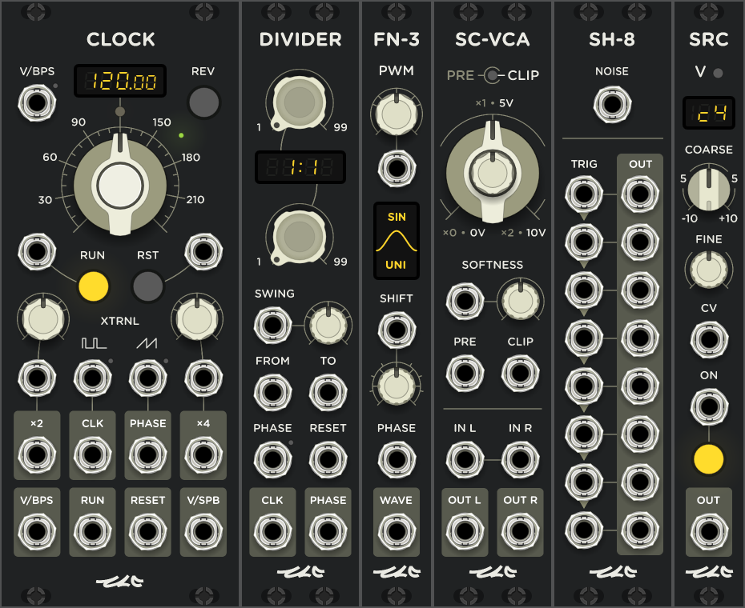

# ZZC Modules

ZZC is a pack of VCV Rack plugins developed by [Sergey Ukolov (zezic)](https://github.com/zezic).
The purpose of this pack is to make operations from the world of classic DAW easier to reproduce in VCV patches and not loose the advantages of CV control.

## Why it's not listed in VCV Plugin Manager?

This module pack is not added to VCV Plugin Library yet because documentation for it is still under work. You can use [binary builds](https://github.com/zezic/ZZC/releases) for now.

## Contributing

I welcome Issues, Pull Requests to this repository if you have suggestions for improvement.
Also, new module ideas are welcome. If module idea is really in demand, feels original and not too complicated with high probability I will develop it shortly if I have enough spare time.

## Building on Linux

```bash
export RACK_DIR=/path/to/Rack-SDK
make -j7
```

## Helpers for IDE

```bash
pip install compiledb
compiledb make
```
