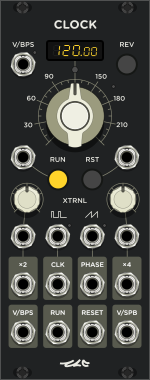
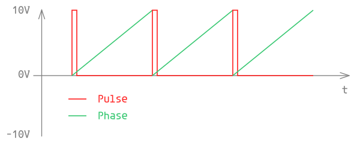
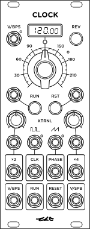

<!---
start: affixing
affixed: blueprint
blueprint: clock-blueprint.svg
preview: clock.svg
-->

# Clock

  

> Генератор импульсов и фазы

Clock - это генератор импульсов, используемых в качестве информации о состоянии транспорта в модульной среде. Этот модуль предоставляет несколько необычных возможностей, отличающих его от большинства LFO или типичных источников импульсов:

* Вход и выход в виде фазы текущего периода (0V - 10V) помимо традиционного *импульсного* формата
* Синхронизация с частотой внешнего источника импульсов
* Поддержка реверса
* Два дополнительных генератора промежуточных импульсов с настраиваемым свингом
* Вход и выход V/BPS, выход V/SPB

## История создания

Изначально этот модуль был разработан из-за желания иметь не только источник импульсов, но и знать о промежуточном состоянии транспорта. Говоря более прямым языком - я хотел точно знать, где находится воспроизведение моего трека между ударами доли не дожидаясь следующего импульса. Для этого я решил использовать пилообразный сигнал, где минимальное значение означает начало доли, а максимальное - её завершение. За счёт такого сигнала другие модули могут определить с какой скоростью движется транспорт, в какую сторону он движется и в какой точке времени между ударами бита он находится. Как позже выяснилось в разговорах с другими пользователями и разработчиками модульных систем, я *изобрёл* что-то похожее на подход с использованием понятия [комплексной амплитуды](https://ru.wikipedia.org/wiki/Комплексная_амплитуда). Наглядное объяснение смысла комплексной амплитуды или так называемого *Phasor'а* можно найти в [документации к Audulus](http://docs.audulus.com/nodes/#phasor).

## Фаза

Конкретно в модуле Clock для выражения фазора используется только одна составляющая, а не минимум две, как это принято при объяснении комплексной амплитуды. Если на словах это звучит недостаточно ясно, то всё становится понятно при взгляде на следующую диаграмму:

Здесь **Pulse** - сигнал с импульсами, сообщающими о начале следующей доли, а **Phase** - сигнал отображающий прогресс текущей доли, иными словами, её фазу. В отличии от классического фазора за диапазон значения фазы было взято не число Пи, а 10 вольт, что должно повысить помехоустойчивость, упростить анализ сигнала и его преобразования. Конечно, сигнал с фазой будет не так полезен в реальных аналоговых системах из-за естественной непостоянности напряжения и трудности его калибровки, но в идеальной цифровой среде он вполне применим.

### Изменение скорости

При изменении скорости (частоты) генератора фаза сразу же отображает это изменение не дожидаясь следующего импульса доли. Например, так выглядит постепенное замедление генератора до нулевой скорости:

А так выглядит остановка в середине доли, изменение направления на противоположное и старт:

## Свинг

Модуль Clock предоставляет два отдельных выхода для генераторов субимпульсов. Первый генератор выдаёт импульсы на частоте в два раза выше, чем базовая частота модуля (x2), второй генератор выдаёт импульсы на частоте вчетверо выше, чем базовая (x4). Особенность этих генераторов в изменяемом факторе свинга, которым можно управлять с помощью регуляторов на панели и при помощи управляющего напряжения (CV). Чем выше фактор свинга, тем ближе будет расположен субимпульс к концу периода, который он разделяет, и на оборот, чем меньше фактор, тем сильнее субимпульс свдинется к началу периода. Для примера, взгляните, как влияет фактор свинга на расположение субимпульсов первого генератора:

Стандартное значение для центрального положения регулятора свинга - 50%, в этом режиме каждый второй субимпульс оказывается на середине базового периода.

Интересным фактом является то, что второй генератор субимпульсов (x4), использует расположение субимпульсов первого генератора (x2) как границы периодов для расположения уже своих импульсов. То есть, при изменении фактора свинга первого генератора, импульсы второго генератора сместятся в зависимости от того, как изменились периоды между импульсами первого генератора. Вот, как это выглядит на графике:

Добавляя к этому возможность модулировать фактор свинга мы получаем интересный инструмент для создания ритмических рисунков. Учитывайте, что при плавном модулировании фактора свинга вы можете получить не всегда желаемую *трещётку*, это, на первый взгляд неожиданное, поведение связано с тем, что изменение фактора свинга влияет на работу алгоритма моментально, и при работе транспорта может происходить такое, что фаза основного генератора модуля будет снова и снова проходить тот новый порог, на котором *теперь уже* должен сработать генератор субимпульсов.

## Внешние источники темпа

Модуль Clock поддерживает синхронизацию с внешними источниками темпа в нескольких режимах.

* Внешний источник импульсов (CLK)
* Внешний источник фазы (PHASE)
* Внешний источник импульсов и фазы (CLK + PHASE)
* Внешний источник вольт на долю на секунду (V/BPS)

Режим выбирается исходя из того, в какие входы для внешнего источника темпа подключены кабели. Вы можете определить, какой режим активен и какие сигналы для него используются по маленьким индикаторам, расположенным рядом с гнёздами для подключения внешних источников.

### Синхронизация: Внешний источник импульсов (CLK)

После активации этого режима модуль дожидается поступления как минимум двух импульсов на вход CLK, после чего сравнивает временной промежуток между ними и выставляет свою главную частоту исходя из этого. Затем он продолжает измерять промежутки между каждыми двумя последними входящими импульсами и резко корректирует свою частоту. В этом режиме точка старта фазы основного генератора может оказаться смещена относительно внешних импульсов, так что вы должны вручную в нужный момент послать импульс на вход RESET, чтобы сбросить и синхронизировать фазу.

### Синхронизация: Внешний источник фазы (PHASE)

В режиме внешней фазы вход с сигналом внешней фазы используется практически напрямую. Изменение значения внешней фазы берётся в учёт сразу же, как только режим остаётся активным на протяжении хотя бы двух сэмплов, то есть, почти моментально. В идеале этот сигнал должен быть пилообразной волной в диапазоне от 0 до 10 вольт, но вы можете пробовать эксперементировать с его формой. Модуль будет воспринимать резкие скачки сигнала с одного крайнего положения на другое как момент начала новой доли и будет генерировать импульс на выходе CLK в этот момент, так что всё же существует некоторое ограничение на максимальную частоту внешней фазы, хотя, я не думаю, что на практике вам понадобятся сумасшедшие частоты, близкие к получастоте сэмплирования, для выражения BPM.

### Синхронизация: Внешний источник импульсов и фазы (CLK + PHASE)

Этот режим работает почти так же, как и режим с одним только внешним источником фазы (PHASE). Он отличается от вышеупомянутого режима тем, что не полагается на резкие скачки значения внешней фазы в противоположную по полярности область для определения начала новой доли, а вместо этого использует импульсы внешнего источника для генерации своих импульсов и субимпульсов.

### Синхронизация: Внешний источник вольт на долю на секунду (V/BPS)

Этот режим не совсем является режимом синхронизации, а скорее, является им по совместительству, так как его основная задача заключается в предоставлении возможности модуляции темпа.

> #### Что такое V/BPS?
> Чтобы исключить размытость вышеупомянутой аббревиатуры (V/BPS), я объясню её смысл максимально ясно. "V/BPS" означает "volts per beat per second", что в переводе на русский звучит как "вольты на удар в секунду". Это звучит запутанно, но вот что эта величина выражает - количество вольт, соответствующее количеству ударов (или битов, или долей), умещающихся в секунде времени. Для примера возьмём темп в 120 BPM, что означает 120 ударов в минуту. Так как в минуте 60 секунд, мы получим 2 удара в секунду. То есть, для выражения такого темпа в виде V/BPS необходимо будет использовать 2 вольта. Для 180 BPM - 3 вольта, для 240 BPM - 4 вольта. Получается, что каждый вольт прибавляет 60 BPM. Возможно, это не всегда самый удобный способ выразить разницу между одним темпом и другим, так что я думаю, что я должен добавить ковертер для этой величины, как и для обратной ей - V/SPB, о которой вы можете прочитать чуть ниже.

И так, теперь когда вы знаете, что такое V/BPS, вы можете просто прибавить темп, выражаемый этой величной к темпу, который установлен регулятором на панели модуля и получить финальное значение. Для использования значения на входе V/BPS в абсолютном режиме главная ручка темпа должна быть установлена в ноль.
Интересно то, что вход V/BPS поддерживает отрицательные значения, что позволяет развернуть направление транспорта (иными словами, включить реверс).

## Реверс

Реверс активируется нажатием на кнопку REV. Имейте в виду, что эта кнопка не будет работать, если модуль находится в режиме синхронизации, при котором используется внешний источник фазы.
В режиме реверса значение на выходе PHASE превращается из нарастающей от 0 до 10 вольт пилы в ниспадающую с 10 вольт до 0. Так же, ритмический рисунок субимпульсов с их факторами свинга начинает воспроизводиться в обратную сторону, а значение на выходе V/BPS становится отрицательным. При этом, значение на выходе V/SPB (не PBS, а SPB!) остаётся таким же, каким было при нормальном направлении транспорта, почему так происходит и что означает величина V/SPB вы узнаете в следующем параграфе.

## V/SPB

V/SPB - это величина, выражающая продолжительность одной доли в секундах, аббревиатура означает "volts per second per beat". Чем медленнее темп, тем дольше длится каждая доля и тем больше секунд в ней умещается. Эта величина может быть полезна для установки времени задержки в таких эффектах, как эхо (Delay). Выходное значение ограничено 10 вольтами, а значит, наиболее медленный темп, для которого этот сигнал будет корректным равен 6 BPM (60 секунд / 10 секунд = 6 долей).

## Главная панель

<!---
start: legend
-->

<!---
start: legend-group
slug: inputs
-->

### Входы

* <!---
  x: 10
  y: 52
  slug: vbps
  type: labeled-socket
  -->
  <a name="inputs-vbps" href='#inputs-vbps'>V/BPS</a> - вольты на бит на секунду. Напряжение на входе регулирует текущий темп модуля, каждый вольт прибавляет 60 BPM к текущему значению. Поддерживаются отрицательные значения, они могут заставить работать генератор в обратную сторону (реверс).

* <!---
  x: 10
  y: 145
  slug: run
  type: simple-socket
  -->
  <a name="inputs-run" href='#inputs-run'>Run</a> - пуск или пауза генератора. Поддерживаются только импульсы положительного напряжения.

* <!---
  x: 114
  y: 145
  slug: reset
  type: simple-socket
  -->
  <a name="inputs-reset" href='#inputs-reset'>Reset</a> - сброс фазы. Сбрасывает фазу на ноль. Не имеет влияния, когда используется внешний источник фазы.
  > Частый вариант патчинга - подключение выхода [Run](#outputs-run) во вход [Reset](#inputs-reset). При таком подключении фаза транспорта сбрасывается каждый раз при остановке и запуске генератора, что может быть удобно для синхронизации подключенных секвенсоров и других устройств.

* <!---
  x: 10
  y: 224
  slug: swing-x2
  type: simple-socket
  -->
  <a name="inputs-swing-x2" href='#inputs-swing-x2'>x2 Clock Swing</a> - свинг генератора импульсов x2. Диапазон -5V - +5V.

* <!---
  x: 114
  y: 224
  slug: swing-x4
  type: simple-socket
  -->
  <a name="inputs-swing-x4" href='#inputs-swing-x4'>x4 Clock Swing</a> - свинг генератора импульсов x4. Диапазон -5V - +5V.
  > Поданное напряжение масштабируется на оставшийся диапазон в зависимости от того, в каком положении находится [регулятор свинга](#controls-swing-x4). Это же относится и к предыдущему входу.

* <!---
  x: 45
  y: 224
  slug: clock
  type: labeled-socket
  -->
  <a name="inputs-clock" href='#inputs-clock'>Clock</a> - внешний источник импульсов.

* <!---
  x: 79
  y: 224
  slug: phase
  type: labeled-socket
  -->
  <a name="inputs-phase" href='#inputs-phase'>Phase</a> - внешний источник фазы. Диапазон 0V - +10V.

<!---
end: legend-group
-->

<!---
start: legend-group
slug: outputs
-->

### Выходы

* <!---
  x: 10
  y: 272
  slug: clock-x2
  type: labeled-socket
  -->
  <a name="outputs-clock-x2" href='#outputs-clock-x2'>Clock x2</a> - импульсы генератора x2.

* <!---
  x: 45
  y: 272
  slug: clock
  type: labeled-socket
  -->
  <a name="outputs-clock" href='#outputs-clock'>Clock</a> - импульсы основного генератора.

* <!---
  x: 79
  y: 272
  slug: phase
  type: labeled-socket
  -->
  <a name="outputs-phase" href='#outputs-phase'>Phase</a> - фаза основного генератора. Диапазон 0V - +10V.

* <!---
  x: 114
  y: 272
  slug: clock-x4
  type: labeled-socket
  -->
  <a name="outputs-clock-x4" href='#outputs-clock-x4'>Clock x4</a> - импульсы генератора x4.

* <!---
  x: 10
  y: 320
  slug: vbps
  type: labeled-socket
  -->
  <a name="outputs-vbps" href='#outputs-vbps'>V/BPS</a> - вольты на бит на секунду (1V = 1BPS = 60BPM). Напряжение может быть отрицательным, что означает обратное направление движения транспорта.

* <!---
  x: 45
  y: 320
  slug: run
  type: labeled-socket
  -->
  <a name="outputs-run" href='#outputs-run'>Run</a> - импульс запуска.

* <!---
  x: 79
  y: 320
  slug: reset
  type: labeled-socket
  -->
  <a name="outputs-reset" href='#outputs-reset'>Reset</a> - импульс сброса фазы.

* <!---
  x: 114
  y: 320
  slug: vspb
  type: labeled-socket
  -->
  <a name="outputs-vspb" href='#outputs-vspb'>V/SPB</a> - вольты на секунды на бит (1V = 1SPB), отображает временную продолжительность доли при текущем темпе. Типичный пример использования - как информацию для таких эффектов, как Delay.

<!---
end: legend-group
-->

<!---
start: legend-group
slug: controls
-->

### Управление

* <!---
  x: 116
  y: 53
  slug: reverse
  type: labeled-led-switch
  -->
  <a name="controls-reverse" href='#controls-reverse'>Reverse</a> - тумблер реверса. Так же является индикатором движения в обратную сторону. Не действует при подключенном внешнем источнике фазы.

* <!---
  x: 41
  y: 82
  slug: bpm
  type: big-knob
  -->
  <a name="controls-bpm" href='#controls-bpm'>BPM</a> - главный параметр, устанавливающий темп (BPM) генератора. Чистый диапазон - от 0 до 240BPM, финальное значение пожет подвергаться влиянию входа [V/BPS](#inputs-vbps).

* <!---
  x: 47
  y: 168
  slug: run
  type: labeled-led-switch
  -->
  <a name="controls-run" href='#controls-run'>Run</a> - пуск или пауза основного генератора.

* <!---
  x: 81
  y: 168
  slug: reset
  type: labeled-led-switch
  -->
  <a name="controls-reset" href='#controls-reset'>Reset</a> - сброс фазы основного генератора. Не действует при подключенном внешнем источнике фазы.

* <!---
  x: 13
  y: 186
  slug: swing-x2
  type: knob-27
  -->
  <a name="controls-swing-x2" href='#controls-swing-x2'>Swing x2</a> - свинг генератора импульсов x2.

* <!---
  x: 109
  y: 186
  slug: swing-x4
  type: knob-27
  -->
  <a name="controls-swing-x4" href='#controls-swing-x4'>Swing x4</a> - свинг генератора импульсов x4.
  > Оба регулятора свинга имеют вспомогательные отметки для положений 25%, 33%, 50%, 66% и 75%.

<!---
end: legend-group
-->

<!---
start: legend-group
slug: indicators
-->

### Индикация

* <!---
  x: 46
  y: 40
  slug: bpm
  type: bpm-display
  -->
  <a name="indicators-bpm" href='#indicators-bpm'>BPM</a> - текущий темп основного генератора. При подключении внешнего источника темпа значение может отображаться нестабильно. Скорее всего, это связано с алиасингом.

* <!---
  x: 71
  y: 66
  slug: phase
  type: medium-led
  -->
  <a name="indicators-phase" href='#indicators-phase'>Phase</a> - индикатор фазы. Вспыхивает в начале фазы каждого бита и затухает по мере её завершения.

<!---
end: legend-group
-->

<!---
end: legend
-->
<!---
end: affixing
-->
