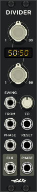
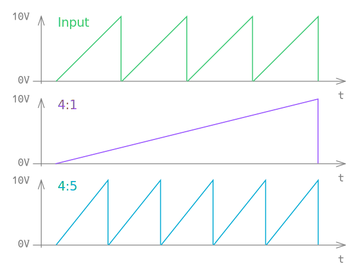
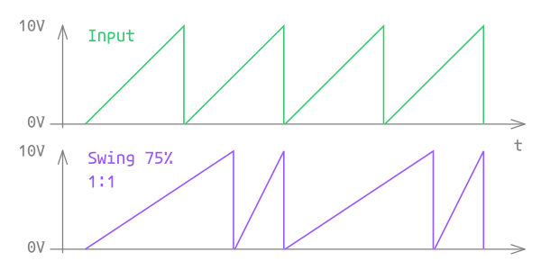
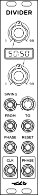

<!---
start: affixing
affixed: blueprint
blueprint: divider-blueprint.svg
preview: divider.svg
-->

# Divider

  

> Phase Divider

Divider - is a module that manipulates frequency of sawtooth signal with range from 0V to 10V. Such signal is used to transmit phase of transport and generated for example by [Clock](./clock) module or by any LFO which is capable of unipolart sawtooth generation.
Divider is similar to Clock Dividers, but it can't work with clock described by pulse and only supports phase as input. Also it supports swing.

## Main Purpose

Main purpose of that module is to convert phase signal with some frequency to phase signal with another frequency. Ratio between frequency of input phase and frequency of output phase can be changed with [controls](#controls-from) and [CV](#inputs-from). Result of such process is displayed on the next graph:

Here you can see that ratio of 4:1 makes output to go 4 times slower than input. Such conversion is able to convert the phase of your 4/4 beat to phase of one bar of such beat. And, for example, ratio of 4:5 can generate a polyrhythm.

## Swing

Swing factor allows to set ratio between length of each even phase and each odd phase:

## Main panel

<!---
start: legend
-->

<!---
start: legend-group
slug: inputs
-->

### Inputs

* <!---
  x: 8
  y: 191
  slug: swing
  type: labeled-socket
  -->
  <a name="inputs-swing" href='#inputs-swing'>Swing</a> - swing factor CV. Range is from -5V to +5V.
  > Voltage range of this input is scaled to the remaining range depending on current position of [Swing Factor](#controls-swing)

* <!---
  x: 8
  y: 233
  slug: from
  type: labeled-socket
  -->
  <a name="inputs-from" href='#inputs-from'>From</a> - CV of ratio numerator.

* <!---
  x: 42
  y: 233
  slug: to
  type: labeled-socket
  -->
  <a name="inputs-to" href='#inputs-to'>To</a> - CV of ratio denominator.

* <!---
  x: 8
  y: 275
  slug: phase
  type: labeled-socket
  -->
  <a name="inputs-phase" href='#inputs-phase'>Phase</a> - phase input. Range is 0V - 10V.

* <!---
  x: 42
  y: 275
  slug: reset
  type: labeled-socket
  -->
  <a name="inputs-reset" href='#inputs-reset'>Reset</a> - phase reset.

<!---
end: legend-group
-->

<!---
start: legend-group
slug: outputs
-->

### Outputs

* <!---
  x: 8
  y: 320
  slug: clock
  type: labeled-socket
  -->
  <a name="outputs-clock" href='#outputs-clock'>CLK</a> - clock output. Impulses are generated with each new phase.
  > This output can be switched to Gate Mode in right-click menu. In Gate Mode it outputs long pulses (1/2 of phase) instead of short.

* <!---
  x: 42
  y: 320
  slug: phase
  type: labeled-socket
  -->
  <a name="outputs-phase" href='#outputs-phase'>Phase</a> - resulting phase. Range is 0V - 10V.

<!---
end: legend-group
-->

<!---
start: legend-group
slug: controls
-->

### Controls

* <!---
  x: 12
  y: 39
  slug: from
  type: cross-knob
  -->
  <a name="controls-from" href='#controls-from'>From</a> - ratio numerator.

* <!---
  x: 12
  y: 123
  slug: to
  type: cross-knob
  -->
  <a name="controls-to" href='#controls-to'>To</a> - ratio denominator.

* <!---
  x: 42
  y: 191
  slug: swing
  type: knob-25
  -->
  <a name="controls-swing" href='#controls-swing'>Swing</a> - swing factor.
  > Knob has marks for values of 25%, 33%, 50%, 66% and 75%.

<!---
end: legend-group
-->

<!---
start: legend-group
slug: indicators
-->

### Indicators

* <!---
  x: 9
  y: 94
  slug: ratio
  type: ratio-display
  -->
  <a name="indicators-ratio" href='#indicators-ratio'>Ratio</a> - current ratio between frequency of input phase and frequency of output phase.

<!---
end: legend-group
-->

<!---
end: legend
-->

<!---
end: affixing
-->
